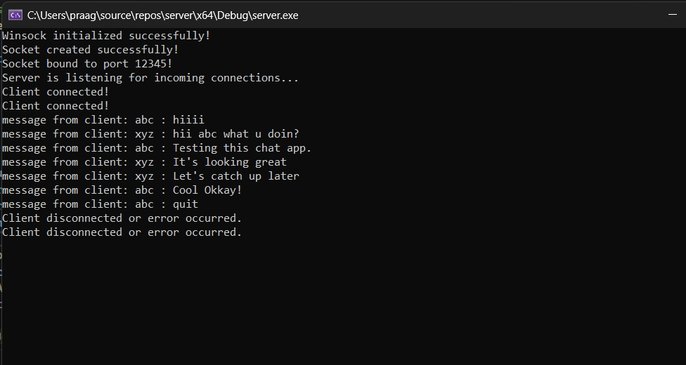
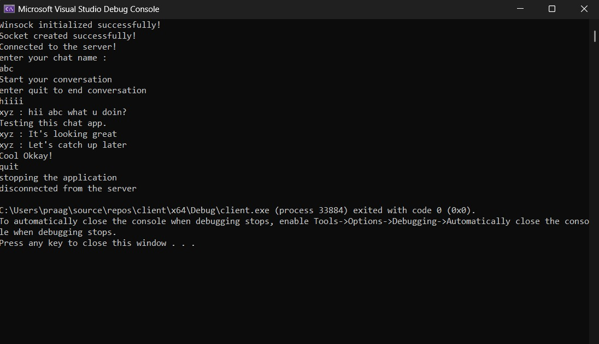
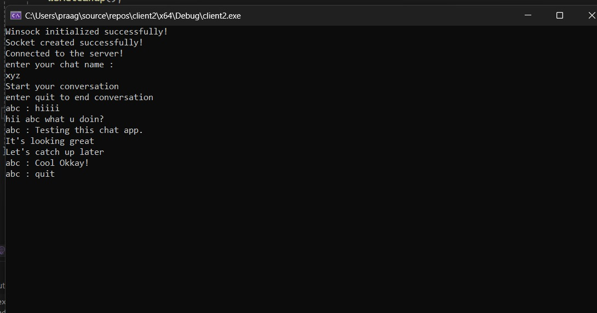

# 💬 Multi-Client Chat Application

A real-time multi-client chat application built in **C++** using **Windows Sockets (Winsock)** that allows multiple users to connect to a central server and communicate with each other simultaneously.


## 🚀 Features

- **Multi-Client Support**: Multiple clients can connect simultaneously
- **Real-Time Messaging**: Instant message broadcasting to all connected clients
- **Thread-Safe Communication**: Uses mutex for safe concurrent access
- **No Message Echo**: Clients don't receive their own messages back
- **Graceful Connection Handling**: Proper client connect/disconnect management

## 🔧 Technical Implementation

### Key Socket Programming Concepts
- **TCP Socket Communication**: Reliable, connection-oriented protocol
- **Multi-Threading**: Concurrent handling of multiple clients using `std::thread`
- **Mutex Synchronization**: Thread-safe access to shared client vector
- **Winsock API**: Windows socket programming with proper initialization and cleanup

### Core Components
- **Server**: Accepts multiple connections, broadcasts messages between clients
- **Client**: Dual-threaded (sender/receiver) for simultaneous send/receive operations

## 📸 Screenshots

### Server Console


### Client 1
 

### Client 2


## ⚡ How to Run

### Prerequisites
- **Windows OS** (uses Winsock API)
- **Visual Studio** or **MinGW compiler**
- **Administrator privileges** (required for socket binding)

### Steps
1. **Clone the repository**
   ```bash
   git clone https://github.com/your-username/multi-client-chat.git
   ```

2. **Compile both files**
   - Using Visual Studio: Create console projects for `server.cpp` and `client.cpp`
   - Using MinGW: `g++ -o server.exe server.cpp -lws2_32 -pthread`

3. **⚠️ IMPORTANT: Run as Administrator**
   - Right-click Visual Studio → "Run as Administrator"
   - Or open Command Prompt as Administrator

4. **Execute in order**
   - Start `server.exe` first
   - Start multiple `client.exe` instances
   - Enter chat name and start messaging!

## 🛠️ Technical Challenges Solved

### 1. **Administrator Permissions**
**Problem**: "Bind failed" errors  
**Solution**: Run as Administrator for network socket access

### 2. **Buffer Corruption** 
**Problem**: Garbage data in received messages  
**Solution**: Proper buffer clearing with `memset()` and null termination

### 3. **Thread Synchronization**
**Problem**: Multiple threads accessing shared client vector  
**Solution**: `std::mutex` with `lock_guard` for thread-safe operations

### 4. **Client Disconnection**
**Problem**: Server crashing on unexpected client disconnect  
**Solution**: Proper error handling in `recv()` and client cleanup

## 🎮 Usage

### Server Side
- Displays connection status and message logs
- Shows "Client connected!" for each new client
- Broadcasts messages between all connected clients

### Client Side  
- Enter your chat name when prompted
- Type messages and press Enter to send
- Messages from other clients appear automatically  
- Type `quit` to disconnect

## 🔧 Configuration

**Default Settings:**
- **Port**: 12345
- **IP**: localhost (127.0.0.1)
- **Buffer**: 1024 bytes (server), 4096 bytes (client)

**To change port/IP**, modify these lines:
```cpp
// Server & Client
serverAddr.sin_port = htons(12345); // Change port
string serveraddr = "127.0.0.1";    // Change IP (client only)
```

## 🐛 Troubleshooting

| Issue | Solution |
|-------|----------|
| "Bind failed" | Run as Administrator |
| "Connection failed" | Start server first, check firewall |
| Only 1 client connects | Use the fixed code version |
| Server shuts down unexpectedly | Ensure proper buffer handling |

## 🚀 Future Enhancements

- GUI interface with Qt/WinAPI
- Private messaging between specific clients
- Chat rooms and user authentication
- File sharing capabilities
- Cross-platform support (Linux/macOS)

## 👨‍💻 Author

**Your Name**  
GitHub: [@your-username](https://github.com/your-username)

---

⭐ **Star this repository if you found it helpful!**
